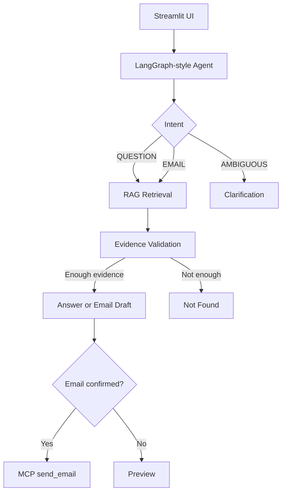

# Meeting Intelligence & Follow-up Assistant

## Overview

This is a local, production-quality prototype for answering questions over synthetic meeting transcripts and generating confirmed follow-up emails. It combines RAG, explicit agent routing, Streamlit, and an MCP email tool with a safe mock email mode.

## Architecture



## RAG Pipeline

Transcript files in `data/` are parsed into metadata-rich chunks containing `meeting_id`, `meeting_title`, `date`, `participants`, `section`, `source_file`, and `chunk_id`. Retrieval uses embeddings plus keyword scoring, top-k filtering, duplicate removal, metadata filtering, and an evidence threshold. ChromaDB persistence is attempted when the package is installed; otherwise the app uses the same embedding pipeline in memory for local tests.

## Agent Workflow

The agent classifies each user request as `QUESTION`, `EMAIL`, or `AMBIGUOUS`.

- Questions route to retrieval, evidence validation, answer generation, and citations.
- Email requests extract meeting, recipient, and email address, retrieve meeting evidence, draft an email, and ask for confirmation.
- Ambiguous requests ask for clarification. Missing meeting, missing recipient, missing email address, and multiple matching meetings are never guessed.

## MCP Email

`mcp/server.py` exposes a FastMCP `send_email(to, subject, body)` tool when the MCP SDK is installed. The tool validates the recipient, subject, and body. `EMAIL_MODE=mock` writes JSON records to `sent_emails/`; `EMAIL_MODE=smtp` sends through configured SMTP settings. The agent calls the MCP client boundary rather than an email provider directly.

## Technology Stack

Python 3.11+, Streamlit, LangGraph, ChromaDB, Sentence Transformers, MCP Python SDK, Pytest, optional OpenAI environment variables.

## Installation

```bash
python -m venv .venv
.\.venv\Scripts\python.exe -m pip install -r requirements.txt
copy .env.example .env
```

## Environment Variables

See `.env.example`. Keep `.env` out of Git. For development, use `EMAIL_MODE=mock`. For SMTP, set `SMTP_HOST`, `SMTP_PORT`, `SMTP_USERNAME`, `SMTP_PASSWORD`, `SMTP_USE_TLS`, and `EMAIL_FROM`.

## How to Run

```bash
.\.venv\Scripts\streamlit.exe run app.py
```

Run the MCP server directly:

```bash
.\.venv\Scripts\python.exe -m mcp.server
```

Run tests:

```bash
.\.venv\Scripts\python.exe -m pytest
```

Run evaluation:

```bash
.\.venv\Scripts\python.exe evaluation\evaluate.py
```

## Example Questions

- What authentication method was selected?
- Who is responsible for implementing the authentication API?
- What QA tests are required for authentication?
- What database vendor was selected?

## Example Email Workflow

User: `Send a follow-up email to Sarah about authentication.`

The assistant retrieves relevant meeting evidence, drafts a professional email, shows recipient, meeting, subject, and body, then asks for confirmation. Only after explicit confirmation does it call MCP `send_email`.

## Evaluation Methodology

`evaluation/questions.json` includes factual, decision, action-item, deadline, multi-meeting, unknown-information, and ambiguous-request checks. `evaluation/evaluate.py` reports pass/fail checks for retrieval source and practical answer matching. It does not claim perfect accuracy.

## Design Decisions

- Deterministic local answer/email generation keeps the project demonstrable without API keys.
- Sentence Transformers are preferred when available; a hashing embedding fallback keeps tests runnable in constrained environments.
- ChromaDB persistence is used opportunistically while the retriever remains testable in memory.
- Mock email mode provides a safe MCP-backed development path.

## Limitations

The local answer generator is intentionally conservative and extractive. Real LLM integration can improve phrasing, but generated content must still be constrained to retrieved evidence. The local MCP client uses the shared validated tool function in mock tests; production deployments can wire it to the FastMCP server over stdio.

## Future Improvements

- Add stricter structured LLM outputs for classification and email generation.
- Add reranking for multi-meeting ambiguity handling.
- Add a production MCP stdio client transport.
- Add observability dashboards for retrieval confidence and email sends.

## GitHub Readiness

Suggested logical commits:

```bash
git add . && git commit -m "Initial project setup"
git commit -m "Add synthetic meeting transcripts"
git commit -m "Implement RAG ingestion and retrieval"
git commit -m "Add LangGraph agent and ambiguity handling"
git commit -m "Add MCP email integration and Streamlit UI"
git commit -m "Add tests evaluation and documentation"
```
